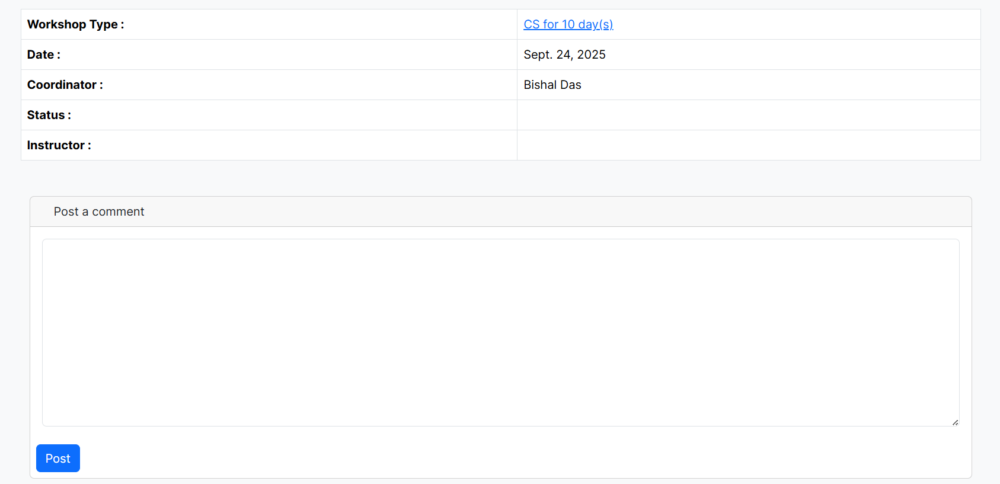

# Workshop Booking – UI/UX Enhanced Version

[](https://www.djangoproject.com/)  
[](https://getbootstrap.com/)
[](https://greensock.com/gsap/)
[](https://developer.mozilla.org/en-US/docs/Web/HTML)
[](https://developer.mozilla.org/en-US/docs/Web/CSS)
[](https://developer.mozilla.org/en-US/docs/Web/JavaScript)


---

## ✨ Overview

This is an enhanced version of the [FOSSEE Workshop Booking system](https://github.com/FOSSEE/workshop_booking).  
The project was redesigned with **improved UI/UX** to make it more modern, mobile-friendly, and user-focused.  

Key Highlights:
- 🔄 **Upgraded from Bootstrap 4 → Bootstrap 5**
- 📱 Optimized for **mobile-first usage** (students often access via phones)
- 🎨 Enhanced **forms, navigation, and layout**
- ⚡ **Balanced performance with richer UI/UX** — slight trade-off in speed for smoother animations powered by GSAP
- ♿ Continued **focus on accessibility and usability**


---

## 🚀 Quick Setup Guide

> ⚠️ **Important:** Use **Python3** and Keep the **exact Django version** mentioned in `requirements.txt`.  
> Upgrading Django may cause errors.

```bash
# 1️⃣ Clone the repository
git clone https://github.com/Bishal-NITS-2003/workshop_booking.git
cd workshop_booking

# 2️⃣ Create a virtual environment and install dependencies
pip install -r requirements.txt

# 3️⃣ Run migrations
python manage.py makemigrations
python manage.py migrate

# (If errors occur for cms_table/teams_table, run migrations manually)
python manage.py makemigrations cms
python manage.py migrate
python manage.py makemigrations teams
python manage.py migrate

# 4️⃣ Create superuser
python manage.py createsuperuser

# 5️⃣ Start server
python manage.py runserver
````

Now, open: **[http://127.0.0.1:8000/](http://127.0.0.1:8000/)** 🎉

---

## 🔑 User Roles & Access

<details>
<summary><b>Superuser</b></summary>

* Login with superuser credentials.
* Create a group `"instructor"` and assign all permissions.
* Add selected users to `"instructor"` group.
* Update their profile positions accordingly.

</details>

<details>
<summary><b> Coordinator</b></summary>

* Registers via `/workshop/register/`.
* Completes account activation via activation link through email/terminal.
* Logs in via `/workshop/login/`.
* View statistics under **Statistics → Workshop Statistics**
* Can propose workshops via **Workshops → Propose a Workshop**.

</details>

<details>
<summary><b> Instructor</b></summary>

* Create workshops via **Create Workshop** tab.
* View statistics under **Statistics → Workshop Statistics**.
* Post comments on coordinator profiles.

</details>

---

## 🖼️ Screenshots of Enhancement

<details>
  <summary>Login Page</summary>
  
  | Before | After |
  | ------ | ----- |
  |  | <br> |
</details>

<details>
  <summary>Forgot Password</summary>
  
  | Before | After |
  | ------ | ----- |
  |  | <br> |
</details>

<details>
  <summary>Registration</summary>
  
  | Before | After |
  | ------ | ----- |
  |  | <br> |
</details>

<details>
  <summary>Change Password</summary>
  
  | Before | After |
  | ------ | ----- |
  |  |<br> |
</details>


<details>
  <summary>Navbar</summary>
  
  | Before | After |
  | ------ | ----- |
  |  |  |
</details>

<details>
  <summary>Coordinator Status Page</summary>
  
  
  | Before | After |
  | ------ | ----- |
  |  |<br> |
</details>

<details>
  <summary>Workshop-Statistics Page</summary>
  
  
  | Before | After |
  | ------ | ----- |
  |  |<br><br><br> | 
</details>

<details>
  <summary>Instructor Status Page</summary>
  

  | Before | After |
  | ------ | ----- |
  |  |<br> |
</details>

<details>
  <summary>Propose Workshop Page</summary>
  
  | Before | After |
  | ------ | ----- |
  |  |<br> |
</details>


<details>
  <summary>Edit Workshop Type Page</summary>
  
  
  | Before | After |
  | ------ | ----- |
  |  |<br> |
</details>

<details>
  <summary>View Profile Page</summary>
  
  
  | Before | After |
  | ------ | ----- |
  |  |<br> |
</details>


<details>
  <summary>Workshop Details Page</summary>
  
 
  | Before | After |
  | ------ | ----- |
  |  |<br><br> |
</details>


<details>
  <summary>Workshop Type Details Page</summary>
  
  
  | Before | After |
  | ------ | ----- |
  |  | |
</details>


<details>
  <summary>Workshop Types List Page</summary>
  
  
  | Before | After |
  | ------ | ----- |
  |  |<br> |
</details>

<details>
  <summary>Add Workshop Type Page</summary>
  
  
  | Before | After |
  | ------ | ----- |
  |  |<br> |
</details>

<details>
  <summary>Team Statistics Page</summary>
  
  
  | Before | After |
  | ------ | ----- |
  |  | |
</details>

---

## Design Reasoning

### 1️⃣ Design Principles (As Used in This Project)


- **Mobile-first Approach**  
  Ensured seamless use on phones and tablets through responsive layouts, collapsible navigation, and touch-friendly controls.

- **Visual Consistency**  
  Applied a unified dark-and-green color palette, consistent spacing, and standardized layouts for cards and tables.

- **Clear Information Hierarchy**  
  Used headings, icons, and card layouts to guide users in quickly understanding page structure and locating key actions or data.

- **Role-based UI**  
  Designed the interface to adapt by user type (instructor, coordinator, admin) so each user only sees relevant actions and information.

- **Modern & Lively Experience**  
  Added subtle animations (using GSAP) and balanced use of black and green shades to create a fresh, engaging feel while keeping load times optimized.


### 2️⃣ Ensuring Responsiveness Across Devices

- Built the base layout using **Bootstrap’s responsive grid system** and components, and then built upon it.  
- Applied knowledge from **TailwindCSS/ CSS** (similar utility classes) to fine-tune spacing and alignment.  
- Used **card-based layouts** for storing and displaying data, which simplified responsiveness across different pages.  
- Focused primarily on **mobile phones and laptops**, ensuring navigation and readability remain smooth across both.  


### 3️⃣ Trade-offs Between Design and Performance

- I aimed to maintain a **balance** between design quality and performance.  
- Prioritized an **interactive and lively design** to improve user engagement.
- Used advanced, high-performance animations JS library live **GSAP**, that is not considered heavy.  
- At the same time, kept the site **lightweight**, ensuring load times and accessibility were not compromised.  
- The approach leaned slightly towards **design enhancements**, but without adding heavy or unnecessary elements that could slow down performance.  


### 4️⃣Challenges and How I Approached Them

- **Design Choices**: Choosing the right color combinations and overall theme was time-consuming, as I wanted the UI to be modern yet readable.  
- **Bootstrap Complexity**: While Bootstrap helped with responsiveness, its default classes and utilities often conflicted with my custom design. I had to carefully study and override them, supported by my background in Tailwind CSS.  
- **Maintaining Responsiveness**: Ensuring a smooth experience across devices was challenging. I adopted a **card-based structure** for data display, which worked well for consistency and mobile-friendliness, though adapting cards to every page sometimes required extra adjustments.  
- **UI-Functionality Alignment**: Some existing functionality did not align well with the new design, and in a few cases, I found issues that needed fixing. I modified views and forms where necessary to ensure the UI and functionality matched correctly.  
- **Bug Fix**: Fixed an error related to automatic redirection of a superuser to the admin panel after login, ensuring smoother workflow for administrators.  


### ✅ Overall Summary

This project focused on enhancing the **UI/UX of the workshop booking system** while keeping the core structure intact.  
The improvements were guided by **mobile-first design principles**, consistent visuals, and a clear information hierarchy.  
By leveraging **Bootstrap** as the base, fine-tuning layouts with CSS utilities, and using a **card-based structure**, I ensured responsiveness across devices, especially for mobile and laptop users.  

I carefully balanced **design and performance**, introducing modern animations with **GSAP** for a lively experience while keeping the site lightweight and accessible.  
During development, I faced challenges around design decisions, Bootstrap overrides, and maintaining responsiveness, but resolved them through structured approaches and prior CSS knowledge.  
Additionally, I fixed some functional issues, including an error with **superuser auto-redirection to the admin panel**, ensuring smoother workflows.  

Overall, the redesigned interface is **cleaner, more responsive, and user-friendly**, delivering a better experience for students and administrators alike.  


> 📝 This project was developed as part of the **Python Screening Task 1: UI/UX Enhancement** for FOSSEE Semester Long Internship - Autumn 2025